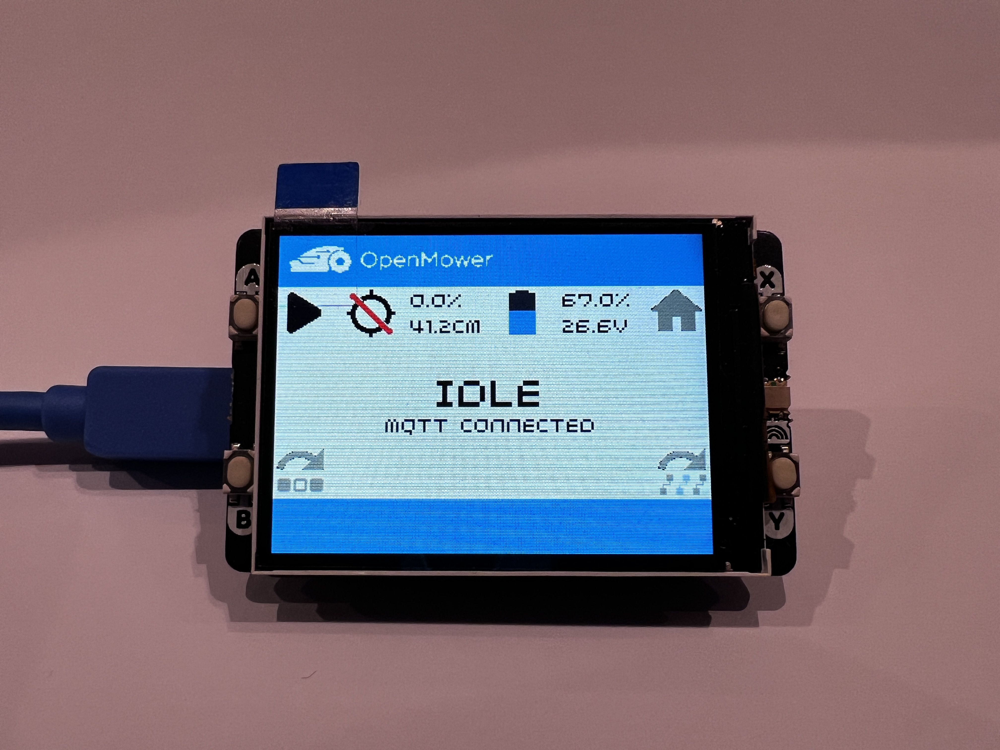
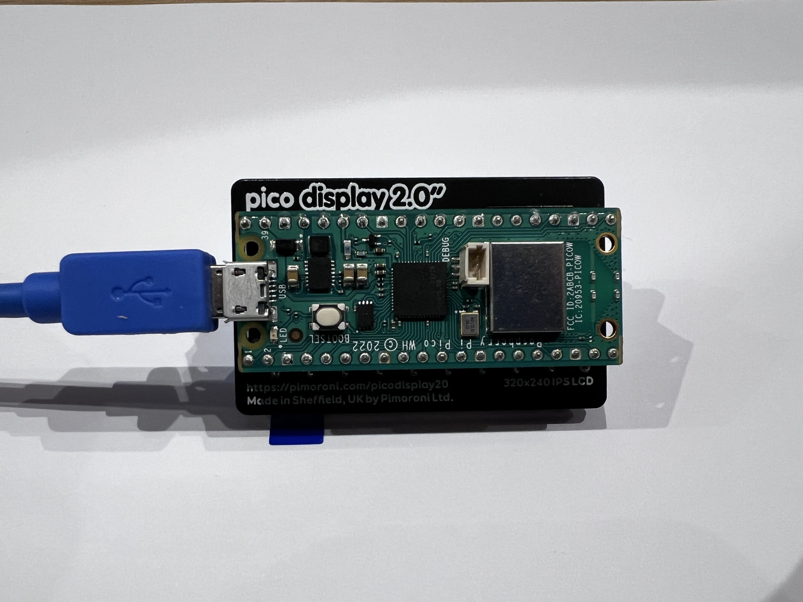
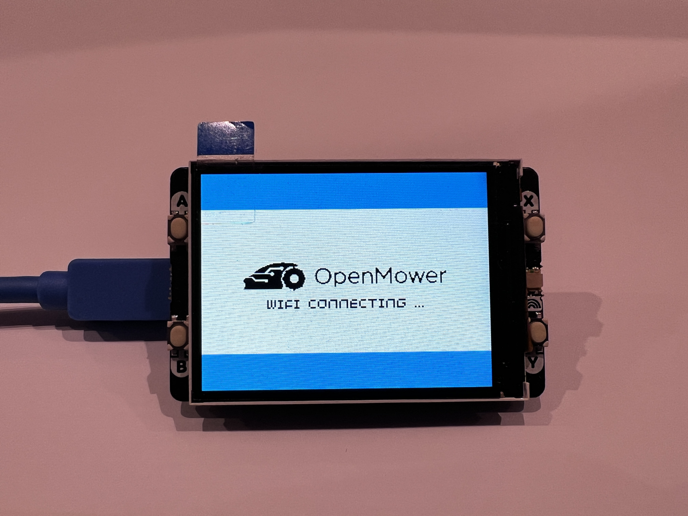

# openmower-display
Raspberry Pico W based Display/Remote Control for mowers controlled by [OpenMower](https://openmower.de).
Display is using WIFI connection (over router or prefferable directly to OpenMower's Hotspot) to establish MQTT connection with OpenMower, to both, read and send MQTT messages.



Inspired by this excellent [pico-assistant](https://github.com/Rookeh/pico-assistant/blob/main) project.
 
# Features

* Show actual OpenMower state, sensors values (GPS accuracy, Battery voltage, Charging)
* Start, Pause, Dock, Reset Emergency, Skip area, Skip path using four display's buttons
* Sleep timer turns off display after 60s, wakes on any button press
* Can be used as the OpenMower remote control as well

# Tools

You will need:

* A [Raspberry Pi Pico W](https://www.raspberrypi.com/news/raspberry-pi-pico-w-your-6-iot-platform/).
* A [Pimoroni Pico Display Pack 2.0](https://shop.pimoroni.com/products/pico-display-pack-2-0?variant=39374122582099).
* A micro-USB cable.
* A UF2 image that supports both the Pico W & Display Pack.
  * Pimoroni's UF2 images added support for the Pico W [pimoroni-pico](https://github.com/pimoroni/pimoroni-pico/releases).
  * You'll find *.uf2 file in this repository as well (but maybe newer version exists)
* A computer (presumably, the one you are reading this on!)
* [Thonny](https://thonny.org/).

Additionally, if your Pico W does not have any GPIO headers pre-attached, you will need:

* A pair of Pico GPIO header pins.
* A soldering iron + solder.
* A breadboard to align the pins while soldering.

# Assembly



If your Pico W does not have GPIO headers attached already, first you will need to attach + solder them to the Pico. 

If it does, you can skip steps 1-6.

1) Set up your soldering station, and warm up your soldering iron.
2) Take your header pins and attach them to your breadboard. Align them with the pin spacing of the Pico, with the 'short' side of the pins facing up.
3) Slot the Pico onto the pins, making sure that the BOOTSEL button is facing up.
4) Once your soldering iron has warmed up, carefully solder each pin to each GPIO pad, making sure not to bridge any connections.
5) Once all pins are soldered, and you are confident there are no bridged connections, turn off your iron and set the breadboard + Pico aside to cool for a few minutes.
6) Gently detach the pins from the breadboard - use the plastic spacer for purchase if needed.
7) Attach the Pico Display Pack 2.0 to the GPIO pins - this should be fairly self explanatory - the display pack has a diagram on its reverse showing the correct orientation of the Pico.

# Configuration

First, clone the contents of this repo to your local machine.

## Pico Setup

While holding down the BOOTSEL button on your Pico, connect it to your device via micro-USB cable.

The Pico should present itself as a USB mass storage drive.

Copy the `.UF2` file that you obtained for this project to the root of the drive. Once copied, the storage drive will automatically disconnect, and the Pico is ready for use.

## Basic Config

There are 2 possible configurations of the display:
1. connecting the display to the same WIFI, the OpenMower is connected
2. connecting the display to the OpenMower's Hotspot (possible if you are using external WIFI USB dongle plugged in the OpenMower's Raspberry Pi with [this](/readme/hotspot.txt.settings) CommitUp configuration of the OpenMower (primary_wifi_device: wlan0)
 * Personally I prefer the option 2, as you will avoid WIFI range issues (Rpi Pico W does not have the external WIFI antenna connector). Connecting the display to the RPi HotSpot will ensure the stable connection. Option 1 will work as well if you have a good WIFI coverage over the mowing areas or if you intend to use it as a Remote Control.
   
Open the following files in the text editor of your choice: `config.py` and `secrets.py`.

In `secrets.py`, you need to provide:

* The SSID and password for your WiFi network or OpenMower Hotspot (prefferable).

Example:
```bash
ssid = "openmower-93"
password = "openmower"
```

In `config.py`, you need to provide:

* The IP address or hostname (openmower.local) of MQTT of the OpenMower, and the MQTT port

Example:
```bash
mqtt_host = "10.41.0.1"
mqtt_port = 1883
```

## First Run

Once the above steps are complete, connect your Pico W to your machine and open Thonny. Make sure to select the Pico's MicroPython environment on the bottom-right of the Thonny window, then, once connected, upload each of the `.py` files to your device.

**NOTE:** Depending on the UF2 image that you used, you *might* need to install the `urequests` package before running the display for the first time. To do this, uncomment the relavent lines in `mqtt.py`, save to the Pico and then run `main.py` once manually in order for the Pico to connect to your network and install the package. Alternatively, you can install `urequests` to the Pico via Thonny's package manager.

Once installed, stop execution, re-comment or delete the lines, save and re-upload to the Pico.

The application will now auto-start whenever you supply power to your Pico.

After successful installation you should see something like that:


Turn on the OpenMower, when the connection is established you should be able to operate the OpenMower:

